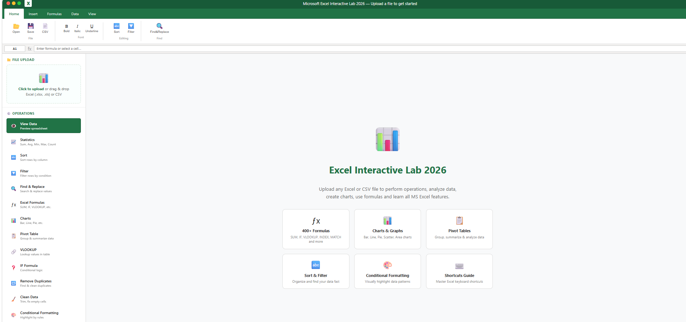

# 📊 Excel Interactive Lab 2026

> **A complete, browser-based Microsoft Excel learning & operations tool — no installation, no backend, no server required.**

[](https://developer.mozilla.org/en-US/docs/Web/HTML)
[](https://developer.mozilla.org/en-US/docs/Web/CSS)
[](https://developer.mozilla.org/en-US/docs/Web/JavaScript)
[](https://www.microsoft.com/en-us/microsoft-365/excel)
[](LICENSE)
[](https://github.com/yashjain)

---

## 🌟 Overview

**Excel Interactive Lab 2026** is a fully-featured, single-file web application that replicates the Microsoft Excel experience in your browser. Upload any `.xlsx`, `.xls`, or `.csv` file and instantly perform 15+ real Excel operations — with results shown live, along with detailed guides on how each operation works in actual Microsoft Excel.

Perfect for:
- 📚 **Students** learning Excel for the first time
- 👩‍💼 **Professionals** who want quick data analysis without opening Excel
- 🧑‍💻 **Developers** building Excel-related tools or learning data processing
- 🎓 **Teachers** demonstrating Excel concepts interactively

---

## ✨ Features

### 🖥️ Excel-Authentic Interface
- Full **Ribbon UI** with Home, Insert, Formulas, Data, View tabs
- **Formula Bar** with cell reference box (just like Excel)
- **Sheet Tabs** — switch between multiple sheets in your file
- **Status Bar** showing live SUM, AVERAGE, row/column counts
- **Drag & Drop** file upload with file size and sheet count info

### ⚙️ 15 Real Operations (Work on Your Actual File)

| # | Operation | What It Does |
|---|-----------|-------------|
| 1 | 👁️ **View Data** | Spreadsheet grid preview with cell selection |
| 2 | 📈 **Statistics** | SUM, AVG, MIN, MAX, MEDIAN, STDEV, VARIANCE, RANGE |
| 3 | 🔤 **Sort** | Sort any column A→Z, Z→A, by number or date |
| 4 | 🔽 **Filter** | Filter rows by 10+ conditions (contains, equals, >, <, empty...) |
| 5 | 🔍 **Find & Replace** | Search values across all columns, replace in bulk |
| 6 | ƒx **Excel Formulas** | 70+ formulas with syntax and examples |
| 7 | 📊 **Charts** | Bar, Line, Pie, Doughnut, Radar, Polar Area (live Chart.js) |
| 8 | 📋 **Pivot Table** | Group by any column, SUM/AVG/COUNT/MIN/MAX |
| 9 | 🔗 **VLOOKUP** | Lookup values with exact/partial match + formula output |
| 10 | ❓ **IF Formula** | Apply conditional logic, see TRUE/FALSE rows |
| 11 | 🔁 **Remove Duplicates** | Find and remove duplicate rows by selected columns |
| 12 | 🧹 **Clean Data** | Trim, UPPER/lower/Proper case, remove special chars, fill blanks |
| 13 | 🎨 **Conditional Formatting** | Highlight cells by rules with color (rendered live) |
| 14 | ⌨️ **Keyboard Shortcuts** | 60+ Excel shortcuts organized by category |
| 15 | 📚 **Complete Guide** | 8 detailed topics covering all of MS Excel |

### 📚 Built-In Learning Content
- **70+ Excel formulas** with syntax and examples (Math, Text, Date, Lookup, Logic)
- **60+ keyboard shortcuts** (Navigation, Editing, Formulas, Formatting, File)
- **Chart types guide** explaining when to use each chart
- **PivotTable how-to** step by step
- **VLOOKUP vs XLOOKUP vs INDEX-MATCH** comparison
- **Full Excel guide** covering: Getting Started, Workbooks, Number Formatting, Tables, Charts, Protection, Power Features (Power Query, Flash Fill, Goal Seek, VBA)

---

## 🚀 Getting Started

### Option 1 — Just Open in Browser
```
1. Download / clone this repository
2. Open index.html in any modern browser (Chrome, Firefox, Edge, Safari)
3. Upload your Excel or CSV file
4. Start using all operations!
```

### Option 2 — GitHub Pages (Live Demo)
```
Settings → Pages → Source: main branch → /root → Save
Your site will be live at: https://yourusername.github.io/excel-interactive-lab/
```

### Option 3 — Direct Download
Download the ZIP from [Releases](../../releases) → extract → open `index.html`

---

## 📁 Project Structure

```
excel-interactive-lab/
│
└── index.html          ← Entire application (HTML + CSS + JS in one file)
```

> **That's it.** One file. No npm. No build step. No server. No dependencies to install.

---

## 🛠️ Tech Stack

| Technology | Purpose |
|---|---|
| **HTML5** | Structure and UI layout |
| **CSS3** | Excel-themed styling, animations, responsive design |
| **Vanilla JavaScript** | All operations and logic |
| **[SheetJS (xlsx)](https://sheetjs.com/)** | Read/write `.xlsx`, `.xls`, `.csv` files |
| **[Chart.js](https://www.chartjs.org/)** | Interactive charts and graphs |

> Both libraries are loaded via CDN — no installation needed.

---
## 📸 Screenshots



---

## 🔒 Privacy

> **100% client-side.** Your data never leaves your browser. No file is uploaded to any server. All processing happens locally using JavaScript.

---

## 🧪 How to Test

1. Upload any `.xlsx` or `.csv` file (sample files available in [test-data/](test-data/) folder)
2. Switch between operations from the left sidebar
3. Try Sort → pick a column → click Sort Now
4. Try Chart → select label & value column → click Create Chart
5. Try Filter → Contains → type any keyword → Apply Filter
6. Try Pivot Table → group by a text column → SUM a number column

---

## 🙋 FAQ

**Q: Does it work offline?**
A: The app itself needs CDN for SheetJS and Chart.js. For full offline use, download those libraries and reference them locally.

**Q: What file formats are supported?**
A: `.xlsx` (Excel 2007+), `.xls` (older Excel), `.csv` (comma-separated values)

**Q: Can I save changes back to Excel?**
A: Yes! After performing operations (Sort, Clean, Replace, Remove Duplicates), click the **Save** button in the ribbon to download the modified Excel file.

**Q: Does it work on mobile?**
A: Yes, the interface is responsive and works on tablets and phones, though desktop is recommended for the full experience.

**Q: How many rows can it handle?**
A: Practically tested up to ~50,000 rows. Beyond that, browser memory may slow it down.

---

## 📋 Changelog

### v1.0.0 — May 2026
- ✅ Initial release
- ✅ 15 operations implemented
- ✅ Full Excel ribbon UI
- ✅ Multi-sheet support
- ✅ Chart generation (6 types)
- ✅ Live pivot table
- ✅ Export to Excel & CSV
- ✅ Complete Excel guide with 70+ formulas

---

## 🤝 Contributing

Pull requests are welcome! For major changes, please open an issue first to discuss what you'd like to change.

```bash
git clone https://github.com/yashjain/excel-interactive-lab.git
cd excel-interactive-lab
# Open index.html in your browser — no build step needed
```

---

## 📄 License

This project is licensed under the **MIT License** — see the [LICENSE](LICENSE) file for details.

---

## 👨‍💻 Author

**Yash Jain**

> Built with ❤️ in May 2026 — making Excel accessible for everyone.

---

<div align="center">
  <b>⭐ If this helped you, please star the repository!</b><br><br>
  Made by <b>Yash Jain</b> | Excel Interactive Lab 2026
</div>
